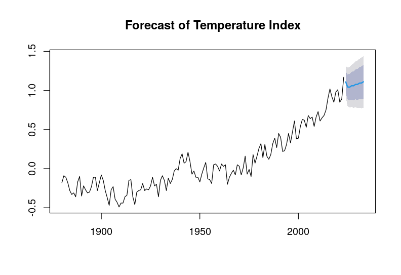
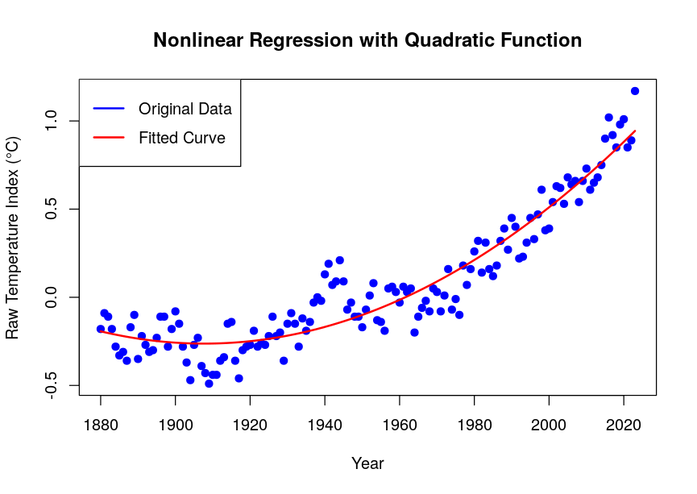

# Global Land-Ocean Temperature Index Analysis and Prediction

This repository contains the code and methodology used in the study titled **"Analysis and Prediction Modeling of Global Land-Ocean Temperature Indices Using Time Series and Nonlinear Regression"**. This research aims to systematically analyze and predict the trends of global land-ocean temperature indices as indicators of climate change.

[Click here for the full paper (Korean)](paper.pdf)

## Overview

### Research Objectives
1. **Analysis**: Evaluate historical trends in global land-ocean temperature indices using time series and nonlinear regression methods.
2. **Prediction**: Develop predictive models to estimate future trends in temperature indices.
3. **Insights**: Provide actionable insights into the accelerating pace of global warming and its implications.

### Key Features
- **Data Source**: NASA Goddard Institute for Space Studies (GISS) Global Land-Ocean Temperature Index (1880–2023).
- **Methods**:
  - Time Series Analysis: ARIMA modeling.
  - Nonlinear Regression: Quadratic modeling to capture nonlinear trends.
- **Results**:
  - Predictive trends of global temperature indices for the next decade.
  - Comprehensive analysis of historical data, including trends and seasonality.


## Results
- **ARIMA Model**:
  - Captured short-term fluctuations and long-term trends.
  - Predicts a gradual rise in global temperature indices over the next decade.
- **Nonlinear Regression**:
  - Highlights accelerated warming trends, with quadratic components capturing exponential growth in temperature increases.

## Key Findings
- Global temperature indices exhibit consistent upward trends, with significant acceleration post-1970s.
- Nonlinear regression reveals that temperature increases are better modeled using quadratic trends, indicating rapid climate change.


## Future Work
- Incorporate external variables (e.g., greenhouse gas concentrations, solar activity) for enhanced model robustness.
- Expand the analysis to regional datasets for localized climate insights.
- Explore machine learning approaches for long-term climate modeling.


## License
This project is licensed under the MIT License.

## Acknowledgments
- Data provided by [NASA GISS](https://data.giss.nasa.gov/gistemp/).

## BibTeX
```
@software{Eom2025Software,
  author = {Sungjun Eom},
  title = {Global Land-Ocean Temperature Index Analysis and Prediction},
  year = {2025},
  url = {https://github.com/SungjunEom/global-temp-analysis-prediction},
  orcid = {0009-0001-8013-2454},
  license = {MIT},
  note = {If you use this repository, please cite the software and/or the associated article.}
}

@article{Eom2025Article,
  author = {Sungjun Eom},
  title = {Global Land-Ocean Temperature Index Analysis and Prediction},
  year = {2025},
  url = {https://github.com/SungjunEom/global-temp-analysis-prediction},
  note = {Paper version.}
}

@misc{Eom2025Github,
  author       = {Sungjun Eom},
  title        = {Global Land-Ocean Temperature Index Analysis and Prediction},
  url          = {https://github.com/SungjunEom/global-temp-analysis-prediction},
  note         = {Accessed: 2025-01-14},
  year         = {2025}
}
```